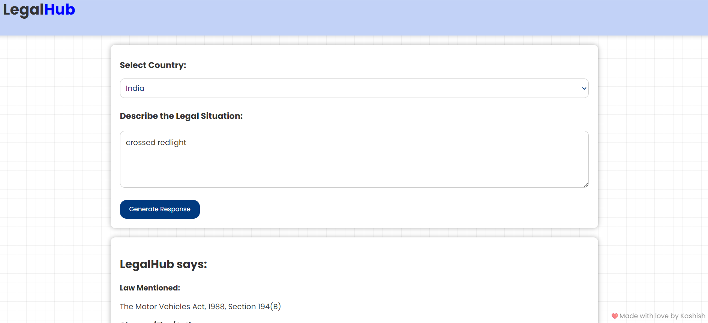

# QuineLaw

Your trustworthy AI legal buddy for instant, reliable answers to everyday legal queries


## Getting Started 


### Prerequisites

- Node.js version >= 18.13.0
- Google gemini pro api key


### Clonning

```bash
git clone https://github.com/kashhisshh/legalhub.git
```

### Installation

```bash 
 npm install
 npm run dev
 ```


